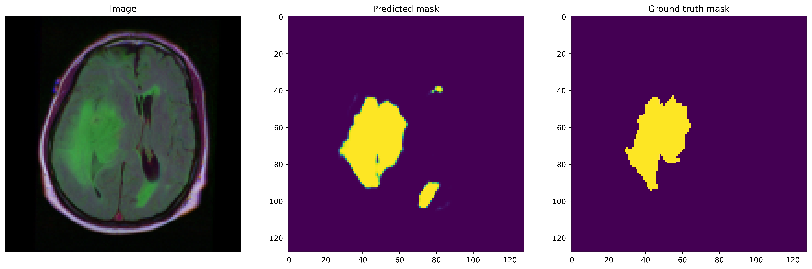
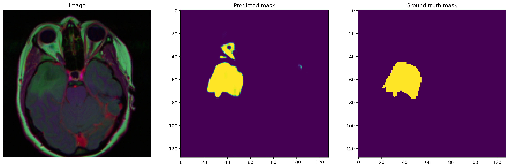
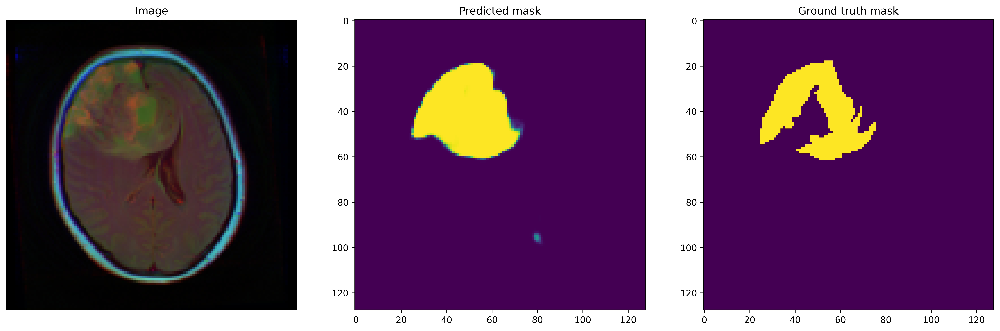
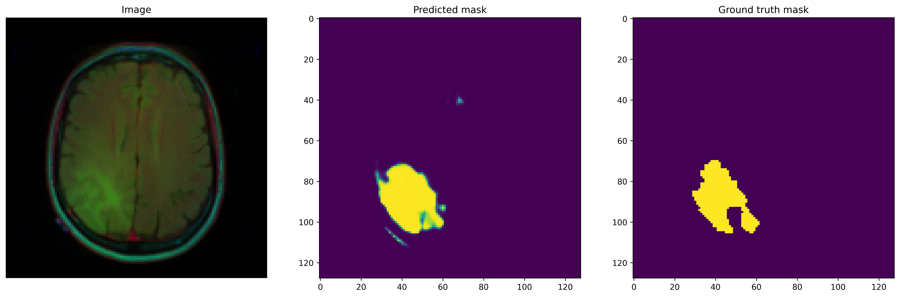

# Brain Tumor Segmentation from MRI using U-Net

An end-to-end deep learning project for segmenting brain tumor regions from MRI scans using U-Net based convolutional neural networks.

The project focuses on medical image segmentation, custom loss design for imbalanced masks, Dice-based evaluation, and practical model packaging with trained checkpoints and prediction artifacts.

## Highlights

- Built a modular 2D MRI segmentation pipeline using TensorFlow/Keras.
- Implemented U-Net encoder-decoder models with skip connections.
- Added custom Dice score metric and combined Dice + weighted binary cross-entropy loss.
- Evaluated segmentation quality using Dice coefficient rather than accuracy alone.
- Packaged trained model checkpoints and prediction visualizations.
- Explored a 3D U-Net path for volumetric MRI segmentation and documented hardware constraints.

## Problem Statement

Brain tumor segmentation aims to identify tumor regions at the pixel level from MRI scans. This is a challenging medical imaging task because tumor regions are often small, irregularly shaped, and highly imbalanced compared with the background.

This project uses semantic segmentation to produce a binary mask for each MRI image:

- Input: brain MRI image
- Output: tumor segmentation mask

## Example Predictions

Sample prediction artifacts are included from the final 2D model output.

| Prediction 1 | Prediction 2 |
| --- | --- |
|  |  |

| Prediction 3 | Prediction 4 |
| --- | --- |
|  |  |

The complete prediction archive is available at `results/predicted_result.zip`.

## Datasets

### LGG MRI Segmentation Dataset

- Source: Kaggle, `mateuszbuda/lgg-mri-segmentation`
- Used for the main 2D U-Net pipeline
- Contains MRI images and manually annotated FLAIR abnormality segmentation masks
- Images and masks are resized to `128 x 128`

### BraTS 2020 Dataset

- Source: Kaggle, `awsaf49/brats20-dataset-training-validation`
- Used for 3D U-Net exploration
- Contains multi-modal volumetric MRI scans such as T1, T1ce, T2, and FLAIR
- Full 3D training was limited by local GPU memory constraints

## Methodology

```text
MRI Data
  -> Image and mask loading
  -> Resizing and normalization
  -> U-Net segmentation model
  -> Dice + weighted BCE optimization
  -> Validation and checkpointing
  -> Prediction mask generation
  -> Dice coefficient evaluation
```

## Model Architecture

The main model is a 2D U-Net:

- Encoder: repeated convolution blocks with batch normalization and ReLU activations
- Downsampling: max pooling and dropout
- Bottleneck: deeper convolutional feature extraction
- Decoder: transposed convolutions for upsampling
- Skip connections: concatenate encoder features with decoder features
- Output: `1 x 1` convolution with sigmoid activation for binary segmentation

The repository also includes a 3D U-Net implementation for volumetric MRI experiments.

## Results

The best reported model used a tuned Dice-aware objective and achieved the strongest segmentation performance.

| Model | Loss / Objective | Main Metric | Reported Test Dice |
| --- | --- | --- | --- |
| Model 1 | Binary cross-entropy | Accuracy + Dice | 0.76 |
| Model 2 | Dice loss + weighted BCE | Dice score | 0.756 |
| Model 3 | Tuned Dice loss + weighted BCE | Dice score | 0.815 |

Accuracy was high for early models, but Dice coefficient is the more meaningful metric for this task because the tumor region occupies a much smaller area than the background.

## Repository Structure

```text
Brain Project/
|-- checkpoints/
|   |-- 2D_firstrun.hdf5
|   |-- 2D_secondrun.hdf5
|   |-- best_model.h5
|   |-- best_model2.h5
|   |-- model2.hdf5
|   `-- model2_1.hdf5
|-- docs/
|   |-- model_card.md
|   `-- project_report.md
|-- results/
|   |-- predicted_result.zip
|   `-- sample_predictions/
|-- src/
|   |-- dataset.py
|   |-- evaluate.py
|   |-- model.py
|   |-- train.py
|   `-- utils.py
|-- requirements.txt
|-- summary.pdf
|-- WiDS Report.pdf
`-- README.md
```

## Setup

Create an environment and install dependencies:

```bash
pip install -r requirements.txt
```

The project was built around TensorFlow/Keras, OpenCV, NumPy, Matplotlib, h5py, and supporting medical-imaging libraries.

## Usage

The source modules are organized so the workflow can be used from scripts or notebooks.

Load 2D image and mask paths:

```python
from src.dataset import get_images_path, read_images

image_paths, mask_paths = get_images_path("path/to/lgg-mri-segmentation")
images = read_images(image_paths, file_type="images")
masks = read_images(mask_paths, file_type="masks")
```

Train the 2D U-Net:

```python
from src.train import train_model

model, history = train_model(X_train, y_train, X_val, y_val)
```

Evaluate predictions:

```python
from src.evaluate import dice_coefficient, process_predictions

binary_predictions = process_predictions(predicted_masks)
dice = dice_coefficient(y_test, binary_predictions)
```

## Project Documents

- `docs/project_report.md`: detailed project writeup
- `docs/model_card.md`: model card with intended use, limitations, and responsible-use notes
- `checkpoints/README.md`: explanation of saved model checkpoints and experiment mapping
- `WiDS Report.pdf`: original detailed report artifact
- `summary.pdf`: short project summary artifact

## Responsible Use

This project is for learning and portfolio demonstration only. It is not a clinical diagnostic system and should not be used for medical decision-making.
